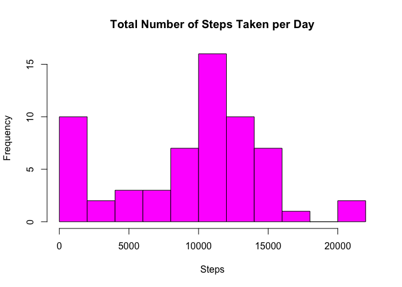
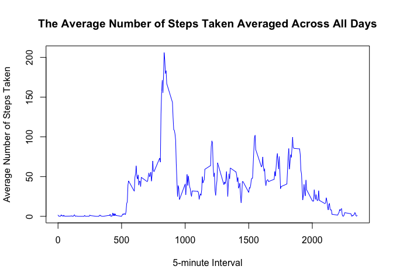
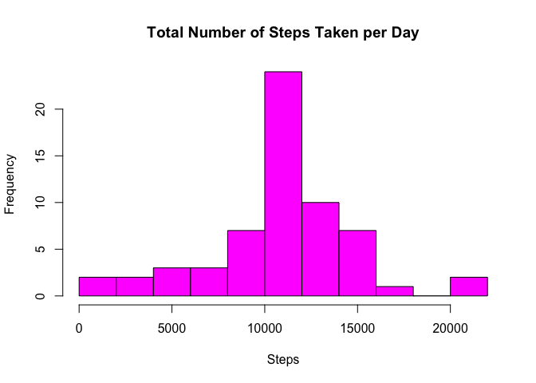
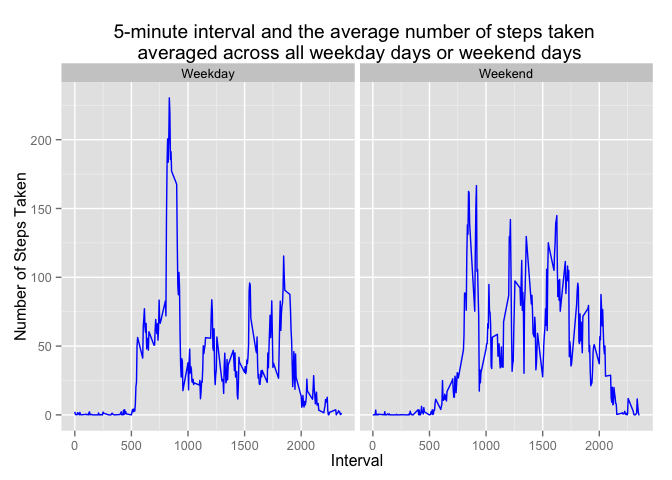

# Reproducible Research Peer Assessment 1
Xinchun Tian  

# Introduction 
The following text is a copy from [Reproducible Research Peer Assessment 1](https://class.coursera.org/repdata-015/human_grading/view/courses/973516/assessments/3/submissions)

It is now possible to collect a large amount of data about personal movement using activity monitoring devices such as a Fitbit, Nike Fuelband, or Jawbone Up. These type of devices are part of the “quantified self” movement – a group of enthusiasts who take measurements about themselves regularly to improve their health, to find patterns in their behavior, or because they are tech geeks. But these data remain under-utilized both because the raw data are hard to obtain and there is a lack of statistical methods and software for processing and interpreting the data.

This assignment makes use of data from a personal activity monitoring device. This device collects data at 5 minute intervals through out the day. The data consists of two months of data from an anonymous individual collected during the months of October and November, 2012 and include the number of steps taken in 5 minute intervals each day.

## Loading and preprocessing the data

```r
activity <- read.csv("activity.csv")
```

Examine the data.

```r
head(activity)
```

```
##   steps       date interval
## 1    NA 2012-10-01        0
## 2    NA 2012-10-01        5
## 3    NA 2012-10-01       10
## 4    NA 2012-10-01       15
## 5    NA 2012-10-01       20
## 6    NA 2012-10-01       25
```

```r
str(activity)
```

```
## 'data.frame':	17568 obs. of  3 variables:
##  $ steps   : int  NA NA NA NA NA NA NA NA NA NA ...
##  $ date    : Factor w/ 61 levels "2012-10-01","2012-10-02",..: 1 1 1 1 1 1 1 1 1 1 ...
##  $ interval: int  0 5 10 15 20 25 30 35 40 45 ...
```

```r
summary(activity)
```

```
##      steps                date          interval     
##  Min.   :  0.00   2012-10-01:  288   Min.   :   0.0  
##  1st Qu.:  0.00   2012-10-02:  288   1st Qu.: 588.8  
##  Median :  0.00   2012-10-03:  288   Median :1177.5  
##  Mean   : 37.38   2012-10-04:  288   Mean   :1177.5  
##  3rd Qu.: 12.00   2012-10-05:  288   3rd Qu.:1766.2  
##  Max.   :806.00   2012-10-06:  288   Max.   :2355.0  
##  NA's   :2304     (Other)   :15840
```

## What is mean total number of steps taken per day?
1. Calculate the total number of steps taken per day.

```r
library(dplyr)
```

```
## 
## Attaching package: 'dplyr'
## 
## The following objects are masked from 'package:stats':
## 
##     filter, lag
## 
## The following objects are masked from 'package:base':
## 
##     intersect, setdiff, setequal, union
```

```r
## Calculate the total number of steps taken per day
activity1          <- group_by(activity, date)
activity1          <- summarise(activity1, steps_per_day = sum(steps, na.rm = TRUE))
```

2. Make a histogram of the total number of steps taken each day.

```r
with(activity1, hist(steps_per_day, breaks = 10, col="magenta", xlab="Steps", main="Total Number of Steps Taken per Day"))
```

 

3. Calculate and report the mean and median of the total number of steps taken per day.

```r
steps_mean        <- mean(activity1$steps_per_day)
steps_median      <- median(activity1$steps_per_day)
```
The mean and median of the total number of steps taken per day are **9354.23** and **10395**.

## What is the average daily activity pattern?
1. Make a time series plot (i.e. type = "l") of the 5-minute interval (x-axis) and the average number of steps taken, averaged across all days (y-axis).

```r
## Calculate the average number of steps per 5-minute interval taken averaged across all days
activity2          <- group_by(activity, interval)
activity2          <- summarise(activity2, steps_per_interval = mean(steps, na.rm = TRUE))

## Use the base plot to make the plot
with(activity2, plot(interval, steps_per_interval, col="blue", type="l", xlab="5-minute Interval", ylab="Average Number of Steps Taken", main="The Average Number of Steps Taken Averaged Across All Days"))
```

 

2. Which 5-minute interval, on average across all the days in the dataset, contains the maximum number of steps?

```r
## Use which.max to find out which 5 minute interval has the maximum number of steps taken
which_interval    <- which.max(activity2$steps_per_interval)
```
The **104** 5-minute interval, corresponding to 5-minute interval value of 835, on average across all the days in the dataset, contains the maximum number of steps.

## Imputing missing values
1. Calculate and report the total number of missing values in the dataset.

```r
nomissingvalues <- sum(is.na(activity))
```
* The total number of missing values in the dataset is 2304.
2. Devise a strategy for filling in all of the missing values in the dataset.
* Let's use the 5-minute interval mean to do the imputation.


```r
## subset the data to NAs and NON-NAs.
activity3_na    <- activity[ is.na(activity$steps),]
activity3_notna <- activity[!is.na(activity$steps),]

## Calculate the steps take of the mean of 5-minute interval
activity3_notna <- group_by(activity3_notna, interval)
activity3_notna <- summarise(activity3_notna, steps_per_interval = mean(steps), na.rm=TRUE)

## Assign the mean values of steps taken per 5-minute interval to the NAs
for (i in seq_len(nrow(activity3_na))) {
    activity3_na[i,]$steps = activity3_notna[activity3_na[i,]$interval==activity3_notna$interval,]$steps_per_interval
}
```

3. Create a new dataset that is equal to the original dataset but with the missing data filled in.

```r
activity4_imputed <- rbind(activity3_na, activity[!is.na(activity$steps),])
```

4. Make a histogram of the total number of steps taken each day and Calculate and report the mean and median total number of steps taken per day. Do these values differ from the estimates from the first part of the assignment? What is the impact of imputing missing data on the estimates of the total daily number of steps?

```r
## Calculate the total number of steps taken per day
activity5          <- group_by(activity4_imputed, date)
activity5          <- summarise(activity5, steps_per_day = sum(steps))

## Plot
with(activity5, hist(steps_per_day, breaks = 10, col="magenta", xlab="Steps", main="Total Number of Steps Taken per Day"))
```

 

```r
## Calculate the mean and median
steps_mean        <- mean(activity5$steps_per_day)
steps_median      <- median(activity5$steps_per_day)
```

The mean and median of the total number of steps taken per day are both 10766.19. Both the mean and median have been increased and the distribution of steps taken per day has a bell shape distribution after imputing the missing values.

## Are there differences in activity patterns between weekdays and weekends?
1. Create a new factor variable in the dataset with two levels – “weekday” and “weekend” indicating whether a given date is a weekday or weekend day.

```r
## mutate
activity6 <- mutate(activity4_imputed, weekday = weekdays(as.Date(date)))
activity6 <- mutate(activity6, weekday = as.factor(ifelse(weekday %in% c("Saturday","Sunday"), "Weekend", "Weekday")))
activity6   <- group_by(activity6, interval, weekday)
activity6   <- summarise(activity6,steps = mean(steps))
```
2. Make a panel plot containing a time series plot (i.e. type = "l") of the 5-minute interval (x-axis) and the average number of steps taken, averaged across all weekday days or weekend days (y-axis).

```r
library(ggplot2)
g <- ggplot(activity6, aes(interval, steps)) + geom_line(color="blue") + facet_grid(. ~ weekday) + labs(x="Interval", y="Number of Steps Taken", title="5-minute interval and the average number of steps taken \n averaged across all weekday days or weekend days")
print (g)
```

 
